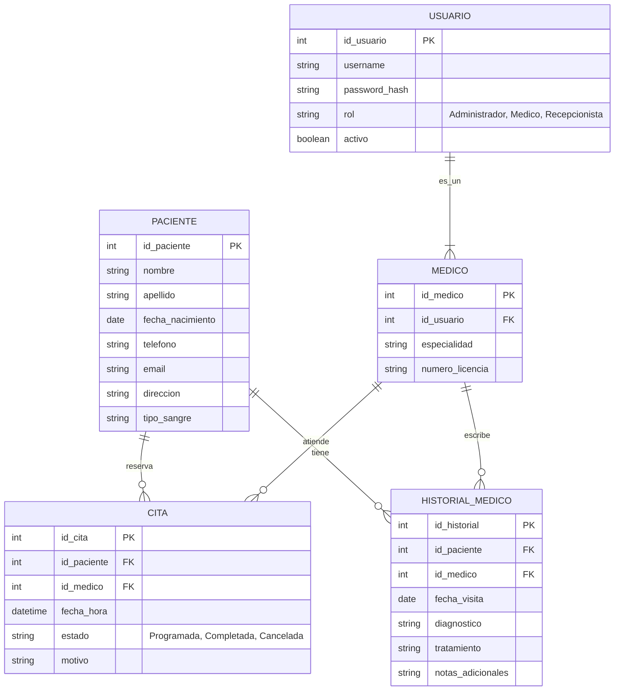

# Diagrama Entidad-Relación (ER) - Sistema de Gestión Hospitalaria

A continuación se presenta el diagrama ER utilizando la sintaxis de **Mermaid**. Puedes copiar este bloque de código y pegarlo en Notion (creando un bloque de "Mermaid") o en cualquier visor de Mermaid en línea.

